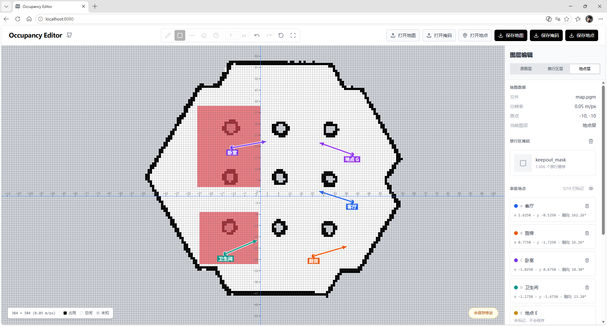

# Occupancy Editor

一个面向 ROS 2 占用栅格地图和 Nav2 Keepout mask 的轻量级局域网编辑器。打开地图后，可以编辑原图、在独立图层绘制禁行区，并标记预设导航点位。地图与掩码可分别导出 PGM/YAML 文件对，导航点位单独保存为 YAML 文件。

应用运行在保存地图文件的电脑或机器人上，局域网内的浏览器通过 `http://<主机 IP>:8080` 访问。地图不会上传到云端。

[English README](README.en.md)

## 致谢

本项目基于并受 [serboba/occupancy-editor](https://github.com/serboba/occupancy-editor) 启发。感谢 Servet Bora Bayraktar 提供原始的 MIT License 开源实现。本版本增加了 ROS PGM/YAML 支持、本地文件 API、独立的原图/Keepout 图层和面向 Nav2 的工作流。

## 功能

### 🗺️ 地图与掩码图层

- **ROS 地图读写**：读取 P2 和 P5 PGM 文件及同名 ROS YAML 元数据，导出紧凑的二进制 P5；缺少 YAML 时使用默认地图参数。目前仅支持 `trinary` 模式。
- **三态地图编辑**：保留占用、空闲和未知栅格，包括 ROS 标准未知值 `205`。
- **独立 Keepout 图层**：在原图上绘制掩码，不修改原始地图；禁行区域独立保存。

### 📍 地点层

- **标记常用地点**：打开地图并切换到「地点层」，选择 `A`–`J` 中的一张卡片（最多 10 个）。在目标位置按下并拖动；按下的位置是落点，拖动确定朝向。
- **编辑与查看**：双击卡片可改名，或调整已标记地点的坐标和朝向；可清除单个地点，或用眼睛按钮暂时隐藏地图上的所有地点标记。
- **保存与载入**：点击「保存地点」只将已标记的地点导出为 YAML。打开地图时会尝试载入同目录的 `waypoints.yaml`，也可点击「打开地点」手动选择地点文件。
- **使用前核对**：地点标记不判断禁行区或机器人能否到达；地图原点带旋转时，请核对导出的朝向。

### 🛠️ 编辑工具

- **编辑工具**：画笔、直线、矩形、橡皮擦和仅原图层可用的未知区域工具，画笔大小 `1-100 px`，支持滚轮调整和按下前的实际 footprint 预览。
- **适合导航的画布**：原图层和掩码层分别撤销/重做，支持重置、适应窗口、有限编辑历史、整图适应窗口的最小缩放比例，以及右键/中键/`Alt` 拖动平移。

### 📁 局域网文件浏览器

- **局域网文件浏览器**：浏览目录、刷新、打开地图、掩码或地点文件，分别保存 PGM/YAML 文件对或地点 YAML，并在确认后删除选中的文件。
- **文件配对校验**：自动查找地图和掩码的同名 YAML。加载掩码时检查尺寸；有配套 YAML 时还会检查分辨率和原点，缺少 YAML 时沿用当前地图参数。
- **清晰的操作反馈**：成功和失败提示与文件选择窗口分层显示。

### ⚡ 技术亮点

- React、TypeScript 和 Vite 前端，使用 Canvas 渲染地图。
- Python 本地文件服务，将文件访问限制在配置的数据根目录内（默认是运行用户的 home 目录）。
- 面向局域网运行，不使用云端存储。

## Demo

### 🖥️ 编辑器界面



_图 1：地图、禁行区与预设导航点位编辑界面。_


_图 2：RViz/Nav2 中的导航点位与禁行区效果示意。_

## 开始使用

### 🧰 前置条件

- Node.js 18 或更高版本
- Python 3

### 作者开发环境

- Ubuntu 22.04 arm64
- ROS 2 Humble

### 📦 安装

克隆仓库并进入仓库根目录：

```bash
git clone https://github.com/clhchan/occupancy-editor.git
cd occupancy-editor
```

然后仍然在这个目录中安装前端依赖：

```bash
npm install
```

### ▶️ 本地运行

`start.sh` 会提供构建后的前端和本地文件 API。如果不存在 `dist/`，会自动先构建前端；若已存在 `dist/` 且源码有更新，请先运行 `npm run build`。

```bash
./start.sh
```

打开 `http://localhost:8080`。服务监听所有网卡时，启动输出会同时列出当前有地址的有线和无线网卡 URL。从同一局域网的其他设备访问时，直接使用其中一个地址，例如 `http://192.168.1.20:8080`。

可以使用环境变量配置监听地址和端口：

```bash
OCCUPANCY_EDITOR_HOST=0.0.0.0 OCCUPANCY_EDITOR_PORT=8080 ./start.sh
```

### 🧪 开发服务器

```bash
./start.sh --dev
```

开发模式下 Python API 运行在 `127.0.0.1:8081`，Vite 前端运行在 `8080`，前端会把 `/api` 请求代理到 API。也可以分开启动：

```bash
npm run dev:api
npm run dev
```

## 使用方法

选择 **打开地图** 加载 `.pgm` 文件；程序会查找同目录的同名 YAML，缺少时使用默认地图参数。地图打开后，可按需使用以下图层。

### 🗺️ 原图层

- 选择 **原图层**，用编辑工具修改占用栅格；点击 **保存地图** 将地图保存为 PGM/YAML 文件对。

### 🚧 禁行区层

- 选择 **禁行区层** 绘制禁行区域；已有掩码可通过 **打开掩码** 载入。载入时会检查尺寸；有配套 YAML 时还检查分辨率和原点。
- 点击 **保存掩码** 单独导出掩码 PGM/YAML 文件对；新建掩码默认使用 `keepout_mask.pgm` 和 `keepout_mask.yaml`。
- **Nav2 集成**：导出的掩码使用 `mode: trinary`，保持与原图相同的尺寸、分辨率和原点，可用于 Nav2 Keepout Filter。运行时的 map server、Filter 和 costmap 配置参见 [Nav2 官方教程](https://docs.nav2.org/rolling/tutorials/general_tutorials/navigation2_with_keepout_filter/navigation2_with_keepout_filter/)。

### 📍 地点层

- 选择 **地点层**，单击 `A`–`J` 卡片，在目标位置按下并拖动设置位置与朝向；双击卡片可编辑名称，以及已标记点位的坐标和朝向。
- 点击 **保存地点** 仅将已标记点位保存为独立 YAML。打开地图时会尝试载入同目录的 `waypoints.yaml`，也可用 **打开地点** 手动载入；文件内容示例：

  ```yaml
  version: 1
  frame_id: map
  map: "home.pgm"
  resolution: 0.05
  origin: [0, 0, 0]
  size: [400, 300]
  waypoints:
    - id: "A"
      name: "客厅"
      pose:
        position: {x: 1.2, y: 2.3, z: 0.0}
        orientation: {x: 0, y: 0, z: 0, w: 1}
  ```

## 本地文件 API

`serve.py` 为网页提供轻量级文件 API：

| 方法 | 接口 | 用途 |
| --- | --- | --- |
| `GET` | `/api/files?path=...` | 列出目录 |
| `GET` | `/api/file?path=...` | 读取 PGM/YAML 文件 |
| `POST` | `/api/save` | 保存单个文件 |
| `POST` | `/api/save-pair` | 保存 PGM/YAML 文件对；第二个文件写入失败时尝试回滚第一个文件 |
| `POST` | `/api/delete` | 删除选中的 PGM/YAML 文件 |

路径被限制在 `--data-root` 指定的目录内，默认是运行服务用户的 home 目录。请只在可信局域网使用，不要把服务直接暴露到不可信网络。

## 开发

运行测试、代码检查和生产构建：

```bash
npm test -- --run
npm run lint
npm run build
```

主要前端代码位于 `src/`，ROS PGM/YAML 转换位于 `src/utils/rosMap.ts`，本地文件服务位于 `serve.py`。

## 许可证

本项目使用 MIT License，详见 [LICENSE](LICENSE)。
