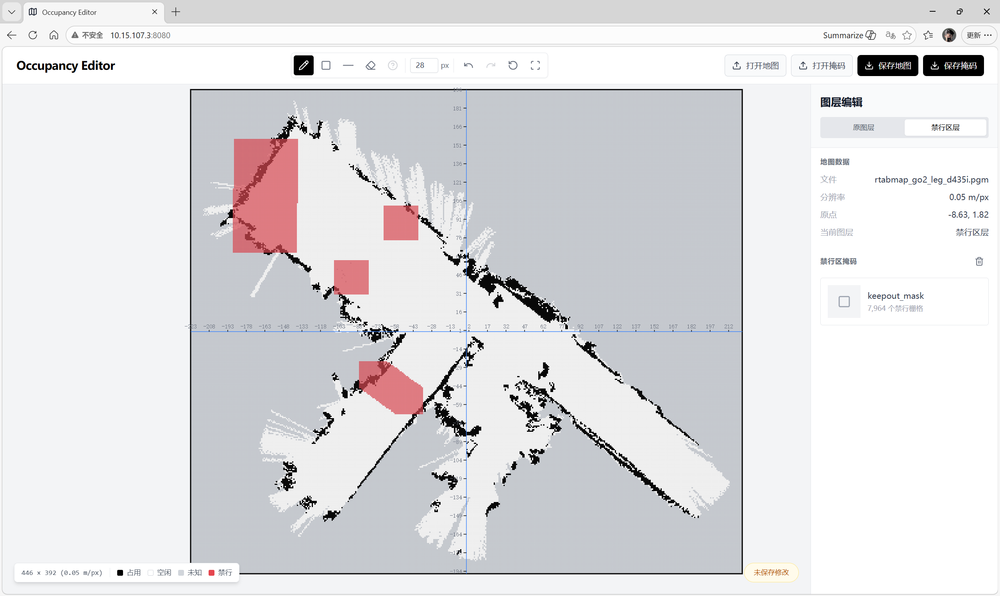

# Nav2 Keepout Mask Editor

一个面向 ROS 2 占用栅格地图和 Nav2 Keepout mask 的轻量级局域网修图网页。打开地图后，
可以在独立的掩码图层上绘制禁行区，并导出可供 `nav2_map_server` 和 Nav2 Costmap Filter
系统使用的 PGM/YAML 文件对。

应用运行在保存地图文件的电脑或机器人上，局域网内的浏览器通过
`http://<主机 IP>:8080` 访问。地图不会上传到云端。

[English README](README.md)

## 致谢

本项目基于并受 [serboba/occupancy-editor](https://github.com/serboba/occupancy-editor) 启发。
感谢 Servet Bora Bayraktar 提供原始的 MIT License 开源实现。本版本增加了 ROS PGM/YAML 支持、
本地文件 API、独立的原图/Keepout 图层和面向 Nav2 的工作流。

## 功能

### 🗺️ 地图与掩码图层

- **ROS 地图读写**：读取带 ROS YAML 元数据的 P2 和 P5 PGM 文件，导出紧凑的二进制 P5。
- **三态地图编辑**：保留占用、空闲和未知栅格，包括 ROS 标准未知值 `205`。
- **独立 Keepout 图层**：在原图上绘制掩码，不修改原始地图；禁行区域独立保存。

### 🛠️ 编辑工具

- **编辑工具**：画笔、直线、矩形、橡皮擦和未知区域工具，画笔大小 `1-100 px`，支持滚轮调整
  和按下前的实际 footprint 预览。
- **适合导航的画布**：原图层和掩码层分别撤销/重做，支持重置、适应窗口、有限编辑历史、
  整图适应窗口的最小缩放比例，以及右键/中键/`Alt` 拖动平移。

### 📁 局域网文件浏览器

- **局域网文件浏览器**：浏览目录、刷新、打开地图或掩码、保存 PGM/YAML 文件对，并在确认后
  删除选中的文件。
- **文件配对校验**：自动匹配同名 YAML，加载掩码前校验尺寸、分辨率和原点。
- **清晰的操作反馈**：成功和失败提示与文件选择窗口分层显示。

### ⚡ 技术亮点

- React、TypeScript 和 Vite 前端，使用 Canvas 渲染地图。
- Python 本地文件服务，并将路径限制在 home 目录内。
- 面向局域网运行，不使用云端存储。

## Demo

### 🖥️ 编辑器与 Keepout 工作流



_图 1：完整的地图与 Keepout 掩码编辑界面。_


_图 2：Nav2 导航时显示的禁行区效果。_

## 开始使用

### 🧰 前置条件

- Node.js 18 或更高版本
- Python 3

### 作者开发环境

- Ubuntu 22.04 arm64
- ROS 2 Humble

### 📦 安装

先克隆仓库并进入仓库根目录。将下面的示例地址替换成你发布到 GitHub 的仓库地址：

```bash
git clone https://github.com/<your-account>/<your-repository>.git
cd <your-repository>
```

然后仍然在这个目录中安装前端依赖：

```bash
npm install
```

### ▶️ 本地运行

`start.sh` 会提供构建后的前端和本地文件 API。如果不存在 `dist/`，会自动先构建前端。

```bash
./start.sh
```

打开 `http://localhost:8080`。服务监听所有网卡时，启动输出会同时列出当前有地址的有线和
无线网卡 URL。从同一局域网的其他设备访问时，直接使用其中一个地址，例如
`http://192.168.1.20:8080`。

可以使用环境变量配置监听地址和端口：

```bash
OCCUPANCY_EDITOR_HOST=0.0.0.0 OCCUPANCY_EDITOR_PORT=8080 ./start.sh
```

### 🧪 开发服务器

```bash
./start.sh --dev
```

开发模式下 Python API 运行在 `127.0.0.1:8081`，Vite 前端运行在 `8080`，前端会把 `/api`
请求代理到 API。也可以分开启动：

```bash
npm run dev:api
npm run dev
```

## 使用方法

1. 选择 **打开地图**，打开一个 `.pgm` 文件。程序会自动查找同目录下的同名 YAML 文件。
2. 选择 **禁行区层**，绘制需要限制的区域。原图会继续作为背景显示。
3. 新建掩码时选择 **保存掩码**。修改已有掩码时，先保持原图打开，再选择 **打开掩码**。
   掩码 PGM/YAML 必须与当前地图的尺寸、分辨率和原点一致。
4. 在文件浏览器中选择目录和文件名。保存会生成 PGM/YAML 文件对，默认掩码文件名为
   `keepout_mask.pgm` 和 `keepout_mask.yaml`。
5. 将导出的掩码文件对用于 Nav2 Keepout 配置，运行时设置请参考下面的官方教程。

## Nav2 Keepout 集成

编辑器会导出 ROS 兼容的 `keepout_mask.pgm` 和 `keepout_mask.yaml` 文件对。掩码使用
`mode: trinary`，并保持与原图相同的尺寸、分辨率和原点，可直接用于 Nav2 Keepout Filter。

运行时的 map server、Keepout Filter 和代价地图配置请参考 Nav2 官方教程：
[Navigation2 with Keepout Filter](https://docs.nav2.org/rolling/tutorials/general_tutorials/navigation2_with_keepout_filter/navigation2_with_keepout_filter/)。

## 本地文件 API

`serve.py` 为网页提供轻量级文件 API：

| 方法 | 接口 | 用途 |
| --- | --- | --- |
| `GET` | `/api/files?path=...` | 列出目录 |
| `GET` | `/api/file?path=...` | 读取 PGM/YAML 文件 |
| `POST` | `/api/save` | 保存单个文件 |
| `POST` | `/api/save-pair` | 原子保存 PGM/YAML 文件对 |
| `POST` | `/api/delete` | 删除选中的 PGM/YAML 文件 |

路径被限制在运行服务用户的 home 目录内。请只在可信局域网使用，不要把服务直接暴露到不可信网络。

## 开发

运行测试、代码检查和生产构建：

```bash
npm test -- --run
npm run lint
npm run build
```

主要前端代码位于 `src/`，ROS PGM/YAML 转换位于 `src/utils/rosMap.ts`，本地文件服务位于
`serve.py`。

## 许可证

本项目使用 MIT License，详见 [LICENSE](LICENSE)。
