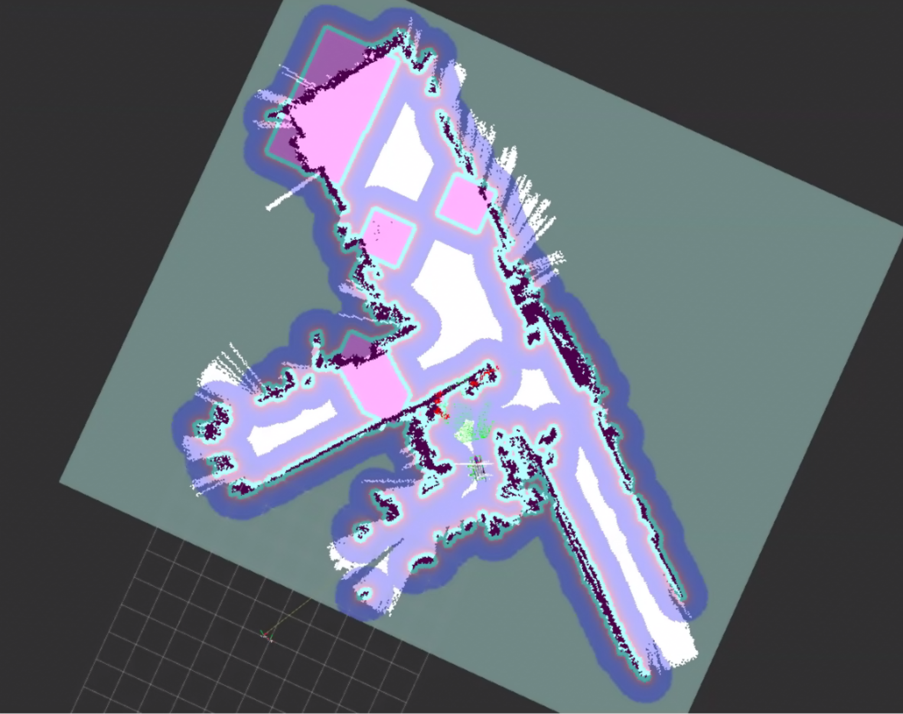

<details open>
<summary><b>中文</b></summary>

## 功能特性

### 地图编辑
- 读取 ROS 2 占用栅格地图的 P2、P5 PGM 文件及配套 YAML
- 保留占用、空闲和未知栅格，支持编辑并保存为 PGM/YAML 文件对
- 支持地图缩放、平移、适应窗口，以及撤销和重做

### Keepout 蒙版编辑
- 在独立图层绘制禁行区，不修改原地图
- 提供画笔、直线、矩形和橡皮擦工具，支持调整画笔大小
- 蒙版可单独撤销、重做，并保存为 Nav2 可用的 PGM/YAML 文件对

### 技术特性
- 内置局域网文件浏览器，可打开、保存和管理地图文件
- 加载蒙版时校验尺寸、分辨率和原点
- 基于 React、TypeScript 和 Canvas；文件由本地 Python 服务读写

## 快速开始

需要 Node.js 18 或更新版本，以及 Python 3。

```bash
# 克隆仓库
git clone https://github.com/clhchan/occupancy-editor.git
cd occupancy-editor
git checkout v0.1.0

# 安装依赖
npm install

# 启动服务器
./start.sh
```

启动后访问 `http://localhost:8080`。同一局域网内的设备可使用启动时显示的主机地址访问。

## 使用方法

1. 在文件浏览器中打开地图 PGM；编辑器会读取同名 YAML。
2. 在地图图层编辑占用栅格，或切换到 Keepout 图层绘制禁行区。
3. 分别保存地图或 Keepout 蒙版的 PGM/YAML 文件对。

## 技术栈

- React 18 + TypeScript
- Vite 4 + Tailwind CSS
- Canvas
- Python 3 本地文件服务
- Vitest

## Demo


_图 1：地图与 Keepout 掩码编辑界面。_



_图 2：Nav2 导航时显示的禁行区效果。_

---

</details>

<details>
<summary><b>English</b></summary>

## Features

### Map Editing
- Read ROS 2 occupancy maps in P2 or P5 PGM format with accompanying YAML metadata
- Preserve occupied, free, and unknown cells; save edited maps as PGM/YAML pairs
- Zoom, pan, fit the map to the window, and undo or redo edits

### Keepout Mask Editing
- Draw restricted areas on a separate layer without changing the source map
- Use pencil, line, rectangle, and eraser tools with adjustable brush size
- Undo or redo mask edits independently and save Nav2-compatible PGM/YAML pairs

### Technical Features
- Built-in LAN file browser for opening, saving, and managing map files
- Mask loading checks map dimensions, resolution, and origin
- React, TypeScript, and Canvas frontend with a local Python file service

## Quick Start

Requires Node.js 18 or newer and Python 3.

```bash
# Clone the repository
git clone https://github.com/clhchan/occupancy-editor.git
cd occupancy-editor
git checkout v0.1.0

# Install dependencies
npm install

# Start server
./start.sh
```

Open `http://localhost:8080` after startup. Devices on the same LAN can use the host address shown by the server.

## Usage

1. Open a map PGM in the file browser; the editor reads its matching YAML.
2. Edit occupancy cells on the map layer or draw restricted areas on the Keepout layer.
3. Save the map or Keepout mask as a PGM/YAML pair.

## Tech Stack

- React 18 + TypeScript
- Vite 4 + Tailwind CSS
- Canvas
- Python 3 local file service
- Vitest

## Demo


_Figure 1. Map and Keepout mask editing interface._


_Figure 2. Keepout zones visible during Nav2 navigation._

</details>
