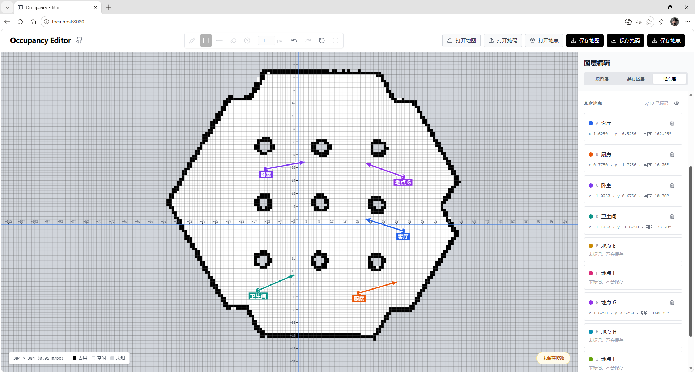
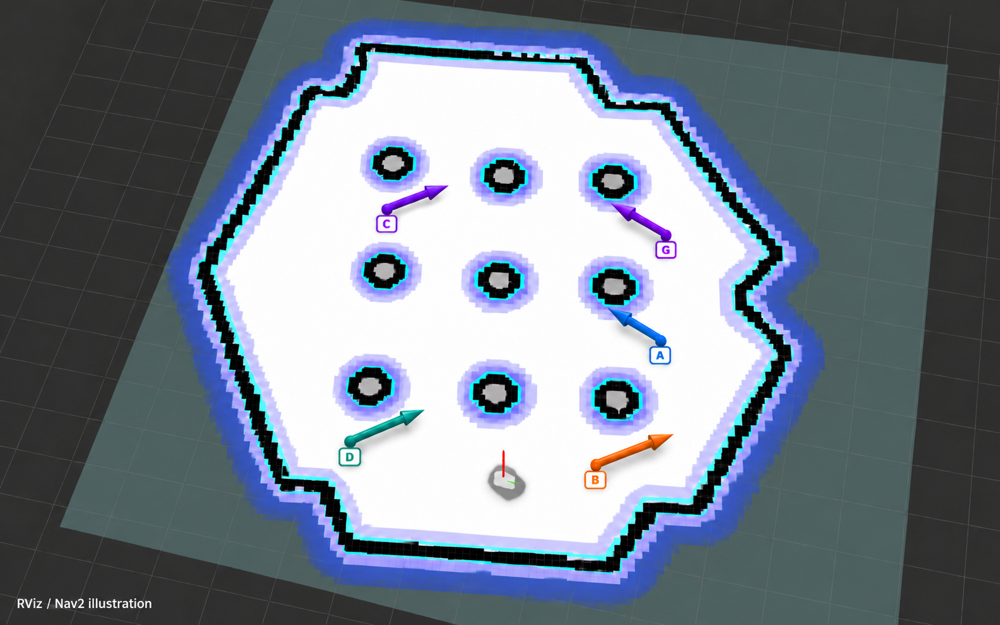

[English](release-notes-v0.2.0.en.md)

## *新增地点层：预设导航点位

- **地点层**：最多可标记 10 个导航点位（`A`–`J`），设置位置和朝向，可改名、调整坐标与朝向、隐藏全部标记或清除单点；拖动标记与清除支持撤销、重做。
- **地点文件**：只将已标记点位保存为独立 YAML；打开地图时尝试载入同目录的 `waypoints.yaml`，也能手动导入；导入时核对地图信息。
- **Nav2 接入**：ROS 2 程序可读取点位，组装 `map` 坐标系的 `geometry_msgs/msg/PoseStamped`，通过 Nav2 的 [Simple Commander `goToPose`](https://docs.nav2.org/rolling/configuration_and_development/simple_commander_api/simple_commander_api/) 导航。

## 使用提示

- 拖动标记只检查落点是否在地图内且不是占用栅格；手工输入的坐标不经过该检查。禁行区和机器人可达性需另行核对。
- 地图原点的 `origin.theta` 非零时，拖动朝向尚未补偿该旋转；使用前请核对导出的朝向。

## Demo

_图 1：地点层与预设导航点位编辑界面。_

_图 2：RViz/Nav2 中预设导航点位的效果示意。_
